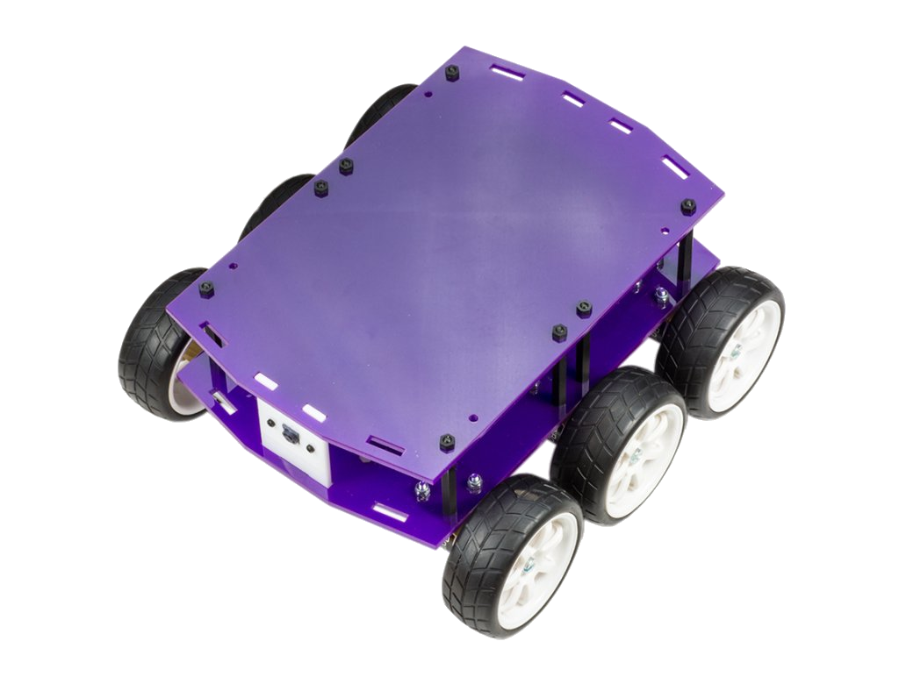
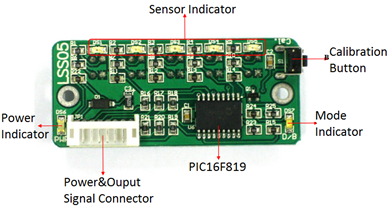
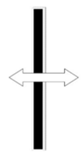

# DiddyBorg Sensor Fusion
{ width=50% }
This repository contain python 3 codes for sensor fusion algorithm developed for a DiddyBorg robot. This code serves as guide for course ELEC-E8740 Basics Sensor Fusion, 2019 at Aalto University.

Dependencies:

install from `raspbian` package manager; e.g.  `sudo apt install`

* `libzbar0`

install from `pip3`
* `openCV`
* `imutils`
* `pynput`
* `pyzbar`

## Connecting to Diddyborg

In this section we will describe how to connect to the robot platform via SSH, and how to run the simulation.

To connect to the robot, you could use SSH connection either directly via terminal, or using `VNC` (preferred one). 

* Turn on the robot using switch located at the bottom of the robot.
* Find the IP address of the robot. Check the MAC address written in the upper part of the robot. Then use an ip scanner to find the associated IP address. If you facing a difficulty to find the IP address, you could also connect a monitor to the robot via an HDMI port located behind the camera (unscrew top part of the robot first). Then connect usb keyboard to robot's USB ports. Then execute `ifconfig`.

* Once you found the IP address of the robot, you can connect to the robot via SSH, with user name:`pi`, password: `pipipipi`. You can also automate this process as below:
```console
    ssh-keygen -t rsa -b 4096
    ssh-copy-id pi@your_raspberry_ip_address
```
* The necessary files are located in 
```console
    ~/Git/DiddyBorg_Sensor_Fusion
```
We have also prepared a set of QR-codes in `~/Git/DiddyBorg_Sensor_Fusion/QR-codes` folder. Please pull from `Git` at least once when you just receive the robot to make sure that you have the unmodified version of program.

## Modules

To run the module change the directory to `~/Git/DiddyBorg_Sensor_Fusion/data`. All log files will be stored in this folder. There are three files that you need to run the robot properly:

* `IMU.py`
* `CameraModule.py`
* `MotorControl.py`

These files stored in `~/Git/DiddyBorg_Sensor_Fusion/DiddyBorg_python`. To check options available for each of these files, execute:
```console
python3 ../DiddyDiddyborg_python/module_xxx.py --help
```
Ideally, you should execute `IMU.py` command until it's ready, and then `CameraModule.py`. Once the camera is ready, then execute `MotorControl.py`.

You can modify (and encougared!) these files to accomodate your need. Should you need to reset the configuration to default, you can always pull from ` Git`.

`git pull`

### IMU
After changing the directory to `~/Git/DiddyBorg_Sensor_Fusion/data`, to collect reading from IMU, you can run
```console
python3 ../Diddyborg_python/IMU.py
```
You can also specify the output file name using `--output=some_files.csv`. Default sampling times is $0.05$, and you can modify it with `--sampling=0.1`.

The IMU log files column are, the Timestamp in ms, linear acceleration in x,y,z axis given in gravity unit, roll and pitch angle from accelerometer in degree, gyroscope x,y,z in degree/s, and magnetometer field strength in x,y,z axis  in Gauss unit.

### CameraModule

To collect reading from IMU, you can execute the following command
```console
python3 ../Diddyborg_python/CameraModule.py
```

You can also specify the output file name using `--output=some_files.csv`. If you have access to X-server when connecting to the robot (using VNC, for example), you can also specify `--show` to show the video stream from the camera module. You can also specify the QR-code length in cm using `--qrlength=xx` where the input is given in cm.
The IMU log files column are, the Timestamp in ms, QR-code number, center position (x,z) of QR-code in pixel, width and height of QR-code in pixel, raw distance from camera to QR-code in cm, raw attitude of the QR-code relative to the camera in deg.

### MotorControl
To run the motor
```console
python3 ../Diddyborg_python/MotorControl.py
```
You can also specify the output file name using `--output=some_files.csv`. 
The IMU log files column are, the Timestamp in ms, first input from 0-1 as a percentage of pulse width modulation (PWM), and the second input.

### AutoCalibrating Line Sensor



Line Sensor has to be calibrated when its tried in a different material for every first time once its calibrated for the black line not necessary for following events. To calibrate it for the black line click the calibration button once and while the LEDs blink robot should be waved like the arrow showed in the following picture. Make sure all five sensors are exposed to both regions ( black and white ). The mode indicator lighting in the module stands for inverse detected region power on. Make sure the mode indicator is off for whole operation.

### Maintainer
Muhammad.Emzir@aalto.fi
